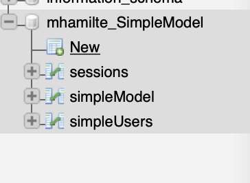
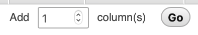

# FFF-SimpleExample

This is a very basic example of how to use the Fat Free Framework to:

- Control routing on your site
- save and recall data from your database
- template site structure to avoid repetition

You should make yourself familiar with how this example works. When you are ready to start your project, simply copy the contents of `FFF-SimpleExample` into your
project folder on the server.

## Setup

1. go to your edinburgh.domains dashboard
2. go to **phpMyAdmin**
3. Select your database `Username_DatabaseName`
4. click `New`
   
5. add a new table named `simpleModel` with these columns
    - You will need to add an additional column
      

<table>
    <tr>
        <td>Name</td>
        <td>Type</td>
        <td>Length/Values</td>
        <td>Index</td>
        <td>A_I</td>
    </tr>
    <tr>
        <td>id</td>
        <td>BIGINT</td>
        <td>-</td>
        <td>Primary</td>
        <td>x</td>
    </tr>
    <tr>
        <td>name</td>
        <td>VARCHAR</td>
        <td>200</td>
        <td>-</td>
        <td>-</td>
    </tr>
    <tr>
        <td>colour</td>
        <td>VARCHAR</td>
        <td>200</td>
        <td>-</td>
        <td>-</td>
    </tr>
</table>

- you can leave other unmentioned attributes blank.
- when you check `A_I` or `Primary` just click `Go` on the pop-up
  
6. click `Save`

## Structure

Noted below are the parts of this project and which role within the MVC design pattern it concerns.

### `autoload/` [Model / Controller]

`autoload` contains the `SimpleController` class that will usually be relevant for interacting with your MySQL Database.

Both the Model _and_ the Controller will need to decide on how the `SimpleController` works.

### `index.php` [Controller]

`index.php` is where the routing on your site happens. Every request for a webpage on your site ends up here.
This is where the _Controller_ will take data form the _Model_ and send it to the _View_. It is also where data is collected
from the _View_ and sent to the _Model_.

### `ui/` [View / Controller]

The `.html` files within the `ui/` folder are where your _View_ decides on how pages are organised. Both _View_ and
_Controller_ will need to talk to each other to decide on how the site is templated and naming conventions for variables.
Everytime you see `{{@A_Variable}}`, the _View_ and the _Controller_ probably need to talk to each other.
